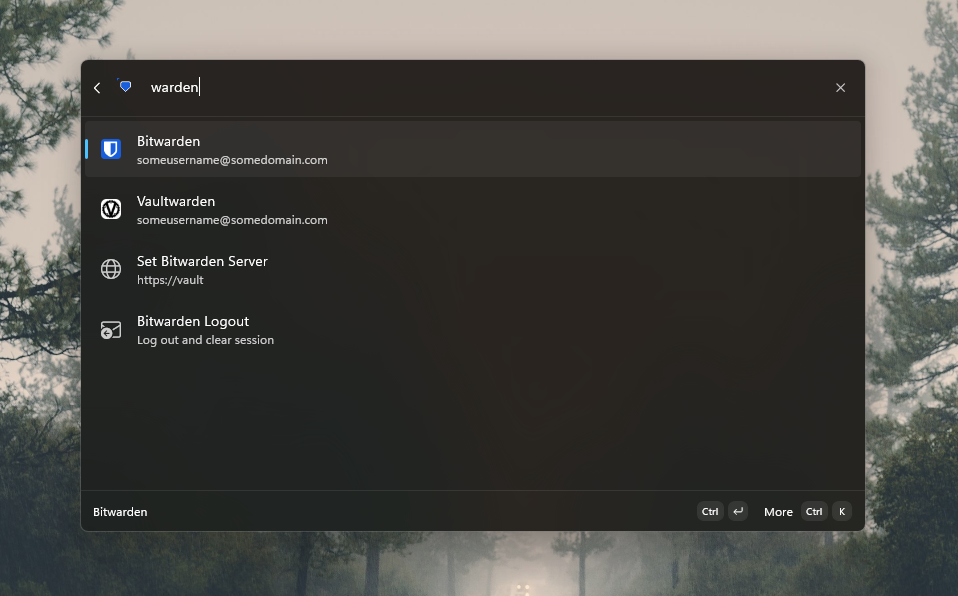

# Hoobi Bitwarden Command Palette Extension

A Windows Command Palette extension that integrates your Bitwarden vault directly into the Windows Command Palette, enabling fast credential search, copy, and launch: without leaving what you're doing.



## Features

- **Vault search**: search all vault items (logins, secure notes, cards, identities, SSH keys) directly from the Command Palette
- **Fallback search**: type anywhere in the Command Palette and Bitwarden results appear as fallback suggestions
- **Copy credentials**: copy usernames, passwords, TOTP codes, card numbers, SSH keys, and more via context menu
- **Open in browser**: launch login URIs directly from search results
- **Open in Bitwarden**: jump to any item in the Bitwarden desktop app or web vault
- **SSH quick-connect**: open SSH sessions from SSH key items with a configured `host` custom field
- **Remember session**: optionally persist your session key in Windows Credential Manager across launches
- **Smart sorting**: recently accessed items appear first, with relevance-based search ranking
- **Background cache**: vault is cached locally and refreshed every 5 minutes for instant results

## Prerequisites

- **Windows 10 (19041+)** or later with [Command Palette](https://learn.microsoft.com/windows/command-palette/) enabled
- **[Bitwarden CLI](https://bitwarden.com/help/cli/)** (`bw`) installed and available on your `PATH`
- **.NET 9 SDK** (for building from source)

## Installation

### From Release

1. Download the `.msix` package for your architecture (x64 or ARM64) from [Releases](../../releases)
2. Download and install the signing certificate ([`HoobiBitwardenCommandPaletteExtension.cer`](HoobiBitwardenCommandPaletteExtension.cer)) to the **Trusted People** store:
   - Double-click the `.cer` file → **Install Certificate** → **Local Machine** → **Place all certificates in the following store** → **Trusted People** → Finish
   - Or via PowerShell (admin):
     ```powershell
     Import-Certificate -FilePath .\HoobiBitwardenCommandPaletteExtension.cer -CertStoreLocation Cert:\LocalMachine\TrustedPeople
     ```
3. Double-click the `.msix` to install, or use PowerShell:
   ```powershell
   Add-AppxPackage -Path .\HoobiBitwardenCommandPaletteExtension_x64.msix
   ```
4. Open the Command Palette: the Bitwarden extension will be available

### From Source

```powershell
git clone https://github.com/your-username/hoobi-bitwarden-command-palette.git
cd hoobi-bitwarden-command-palette/HoobiBitwardenCommandPaletteExtension

# Build for your platform
dotnet build -c Debug -p:Platform=x64
# or
dotnet build -c Debug -p:Platform=ARM64
```

To run in debug mode, use the launch profiles in Visual Studio or:
```powershell
dotnet run -p:Platform=x64
```

## Usage

1. **Open Command Palette** (default: `Win + Ctrl + Space`)
2. **Type "Bitwarden"** to open the vault browser, or just start typing any search term: matching vault items appear as fallback results
3. **First launch**: if your vault is locked, you'll be prompted to enter your master password
4. **Browse results**: click an item to execute its default action (open URL for logins, open in Bitwarden for others)
5. **Context menu**: right-click or use keyboard shortcuts for item-specific actions:

| Item Type    | Available Actions                                                        |
|-------------|--------------------------------------------------------------------------|
| Login       | Copy username, copy password, copy OTP, open URL, open in Bitwarden     |
| Secure Note | Copy notes, open in Bitwarden                                           |
| Card        | Copy card number, copy security code, copy cardholder, copy expiration   |
| Identity    | Copy email, copy name, copy phone, copy username, copy address           |
| SSH Key     | Copy public key, copy fingerprint, open SSH session                      |

### Settings

Access extension settings through the Command Palette settings:

- **Remember Session**: stores your Bitwarden session key in Windows Credential Manager so you don't need to unlock on each launch

### SSH Quick-Connect

For SSH key items, add a custom field named `host` with the value `user@hostname` in Bitwarden. The extension will offer an "Open SSH Session" action.

## Project Structure

```
HoobiBitwardenCommandPaletteExtension/
├── Commands/
│   └── CopyOtpCommand.cs          # TOTP code generation and clipboard copy
├── Helpers/
│   └── VaultItemHelper.cs         # Icon selection, command building, context menus
├── Models/
│   └── BitwardenItem.cs           # Vault item data model (all 5 types)
├── Pages/
│   ├── HoobiBitwardenCommandPaletteExtensionPage.cs  # Main vault browser page
│   └── UnlockVaultPage.cs         # Master password unlock form
├── Services/
│   ├── AccessTracker.cs           # Recently-accessed item tracking
│   ├── BitwardenCliService.cs     # Bitwarden CLI wrapper with caching
│   ├── BitwardenSettingsManager.cs # Extension settings persistence
│   └── SessionStore.cs            # Windows Credential Manager session storage
├── BitwardenFallbackItem.cs       # Fallback search result handler
├── HoobiBitwardenCommandPaletteExtension.cs           # Extension entry point
├── HoobiBitwardenCommandPaletteExtensionCommandsProvider.cs # Command registration
└── Program.cs                     # COM server bootstrap
```

## Building

### Debug

```powershell
dotnet build -p:Platform=x64
dotnet build -p:Platform=ARM64
```

### Release (with trimming)

```powershell
dotnet publish -c Release -p:Platform=x64
dotnet publish -c Release -p:Platform=ARM64
```

### MSIX Package

```powershell
dotnet publish -c Release -p:Platform=x64 `
  -p:GenerateAppxPackageOnBuild=true `
  -p:AppxBundle=Never
```

## CI/CD

The project includes a GitHub Actions workflow (`.github/workflows/build.yaml`) that:

1. **Builds** for both x64 and ARM64 on every push to `main` and on pull requests
2. **Packages** MSIX artifacts for each platform
3. **Creates a GitHub Release** with MSIX packages when a version tag (`v*`) is pushed

To create a release:
```powershell
git tag v0.1.0
git push origin v0.1.0
```

## Security

- Master passwords are sent to the Bitwarden CLI via **stdin** (never as command-line arguments visible in process lists)
- Session keys are stored in **Windows Credential Manager** (OS-level encryption) when "Remember Session" is enabled
- The vault cache is held **in-memory only** and cleared on lock/exit
- All user search input is **regex-escaped** before use in pattern matching
- No vault data is written to disk (only access timestamps for sorting)

## License

MIT
